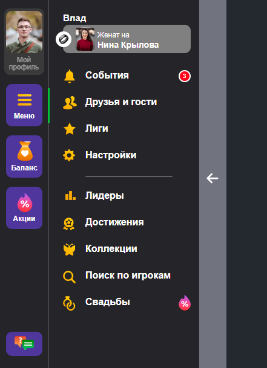

ссылка на Github Pages: https://sergeykorolov.github.io/profile-menu/#

Меню выезжает по клику на кнопку Меню, 
а сворачивается при клике по кнопке со стрелкой.

_Запуск приложения:_
1. git clone https://github.com/sergeykorolov/profile-menu
2. cd profile-menu 
3. npm install
4. npm run dev